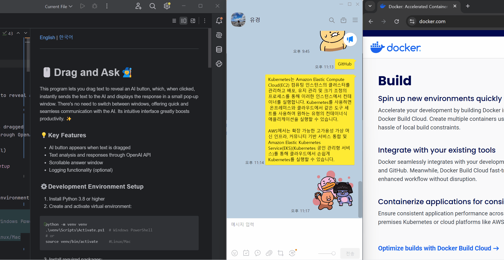

[English](#english) | [한국어](#korean)

---

# 🖱️Drag and Ask🧙

<a name="english"></a>

This program lets you drag text to reveal an AI button, which, when clicked, instantly sends the text to the AI and displays the response in a small pop-up window. There's no need to switch between windows, offering quick and seamless communication with the AI. Its intuitive interface greatly boosts productivity. ✨



### 💡Key Features

- AI button appears when text is dragged
- Text analysis and responses through OpenAI API
- Scrollable answer window
- API key management with user-friendly input window
- Logging functionality (optional)

### ⚙️Development Environment Setup

1. Install Python 3.8 or higher

2. Create and activate virtual environment:
```bash
python -m venv venv
.\venv\Scripts\Activate.ps1  # Windows PowerShell
# or
source venv/bin/activate     #Linux/Mac
```

3. Install required packages:
```bash
pip install -r requirements.txt
```

4. Create environment configuration file:
   - Copy `.envSample` file to `.env` in the project root.
   - `.envSample` is a template file containing default settings.
```bash
copy .envSample .env  # Windows
# or
cp .envSample .env    # Linux/Mac
```

5. When you run the program for the first time, it will prompt you to enter your OpenAI API key:
   - The API key input window will appear automatically.
   - Enter your OpenAI API key and click "Save". If you do not enter the key, the program will automatically exit.
   - The key will be saved in the `.env` file.
   - You can update your API key by restarting the program.

### 🪄Running the Program

```bash
python main.py
```

### How to Use

1. Hold Ctrl key and drag text anywhere on screen to display the AI button.
2. Click the AI button to get responses through OpenAI API.
3. For long responses, a scrollbar will appear automatically.
4. Click the "X" button or outside the answer window to close it.

### Logging and Troubleshooting

You can configure logging settings by modifying the following values in your `.env` file:
```ini
# Logging Settings
ENABLE_LOGGING=false        # Enable/disable file logging (true/false)
ENABLE_CONSOLE_LOGGING=false  # Enable/disable console logging (true/false)
LOG_LEVEL=DEBUG             # Set log level (DEBUG/INFO/WARNING/ERROR/CRITICAL)
```

- File logs are saved in the `logs` directory as `debug_YYYYMMDD_HHMMSS.log`.
- Console logs are displayed in the terminal window in real-time.
- Log level determines the detail of messages. (DEBUG shows all, ERROR shows only errors)

### Project Structure

```
ai-drag/
├── main.py              # Main program
├── ai_service.py        # OpenAI API service
├── requirements.txt    # Package dependencies
├── .envSample         # Environment settings template
├── .gitignore         # Git exclusion settings
├── README.md          # Project description
├── logs/             # Log files directory
├── ui/               # UI modules
│   ├── window_manager.py    # Window management
├── services/         # Service modules
│   ├── clipboard_manager.py  # Clipboard management
│   ├── drag_detector.py      # Drag detection
│   └── api_key_manager.py    # API key management
└── utils/           # Utility modules
    └── logger.py          # Logging utility
```

### Precautions

1. Requires OpenAI API key, and API usage may incur costs.
2. Clipboard contents may be temporarily modified while the program is running.
3. Do not share your `.env` file as it contains your personal API key.

### Troubleshooting

Log files are stored in the `logs` directory and can be helpful when issues occur.
Log file format: `debug_YYYYMMDD_HHMMSS.log`

---

# 🖱️Drag and Ask🧙

<a name="korean"></a>

이 프로그램은 텍스트를 드래그하면 AI 버튼이 나타나고, 클릭하면 즉시 AI에게 질문하여 답변을 작은 창으로 화면에 바로 보여줍니다. 별도의 대화창을 열거나 전환할 필요 없이 빠르고 간편하게 AI와 소통할 수 있습니다. 직관적인 인터페이스로 작업 효율성을 크게 향상시킵니다.✨


## 💡주요 기능

- 텍스트 드래그 시 AI 버튼 표시
- OpenAI API를 통한 텍스트 분석 및 답변
- 스크롤 가능한 답변 창
- 사용자 친화적인 API 키 관리
- 로깅 기능 (선택적 활성화)

## ⚙️개발 환경 설정

1. Python 3.8 이상 설치

2. 가상 환경 생성 및 활성화:
```bash
python -m venv venv
.\venv\Scripts\Activate.ps1  # Windows PowerShell
# or
source venv/bin/activate     #Linux/Mac
```

3. 필요한 패키지 설치:
```bash
pip install -r requirements.txt
```

4. 환경 설정 파일 생성:
    - 프로젝트 루트의 `.envSample` 파일을 `.env`로 복사합니다.
    - `.envSample`는 기본 설정이 포함된 템플릿 파일입니다.
```bash
copy .envSample .env  # Windows
# 또는
cp .envSample .env    # Linux
```

5. 프로그램을 처음 실행할 때 OpenAI API 키 입력:
    - API 키 입력창이 자동으로 나타납니다.
    - OpenAI API 키를 입력하고 "저장" 버튼을 클릭합니다. 입력하지 않으면 프로그램은 종료됩니다.
    - 입력한 키는 `.env` 파일에 저장됩니다.
    - 프로그램을 재시작할 때마다 API 키를 업데이트할 수 있습니다.

## 🪄프로그램 실행 방법

```bash
python main.py
```

## 사용 방법

1. 화면의 아무 곳에서나 Ctrl 키를 누른 상태로 텍스트를 드래그하면 AI 버튼이 나타납니다.
2. AI 버튼을 클릭하면 OpenAI API를 통해 답변을 받아볼 수 있습니다.
3. 긴 답변의 경우 자동으로 스크롤바가 나타납니다.
4. 답변 창의 "X" 버튼 또는 창 외부를 클릭하면 창이 닫힙니다.

## 로깅 및 문제 해결

`.env` 파일에서 다음 값들을 수정하여 로깅을 설정할 수 있습니다:
```ini
# 로깅 설정
ENABLE_LOGGING=false        # 파일 로깅 활성화 여부 (true/false)
ENABLE_CONSOLE_LOGGING=false  # 콘솔 로깅 활성화 여부 (true/false)
LOG_LEVEL=DEBUG             # 로그 레벨 (DEBUG/INFO/WARNING/ERROR/CRITICAL)
```

- 파일 로그는 `logs` 디렉토리에 `debug_YYYYMMDD_HHMMSS.log` 형식으로 저장됩니다.
- 콘솔 로그는 터미널 창에 실시간으로 표시됩니다.
- 로그 레벨에 따라 메시지의 상세도가 결정됩니다. (DEBUG는 모든 내용, ERROR는 오류만 표시)

## 프로그램 구조

```
ai-drag/
├── main.py              # 메인 프로그램
├── ai_service.py        # OpenAI API 서비스
├── requirements.txt    # 패키지 의존성
├── .envSample         # 환경 설정 템플릿
├── .gitignore         # Git 제외 설정
├── README.md          # 프로젝트 설명
├── logs/             # 로그 파일 디렉토리
├── ui/               # UI 관련 모듈
│   ├── window_manager.py    # 창 관리
├── services/         # 서비스 모듈
│   ├── clipboard_manager.py  # 클립보드 관리
│   ├── drag_detector.py      # 드래그 감지
│   └── api_key_manager.py    # API 키 관리
└── utils/           # 유틸리티 모듈
    └── logger.py          # 로깅 유틸리티
```

## 주의사항

1. OpenAI API 키가 필요하며, API 사용에 따른 비용이 발생할 수 있습니다.
2. 프로그램 실행 중에는 클립보드 내용이 일시적으로 변경될 수 있습니다.
3. `.env` 파일에는 개인 API 키가 포함되므로 공유하지 마세요.